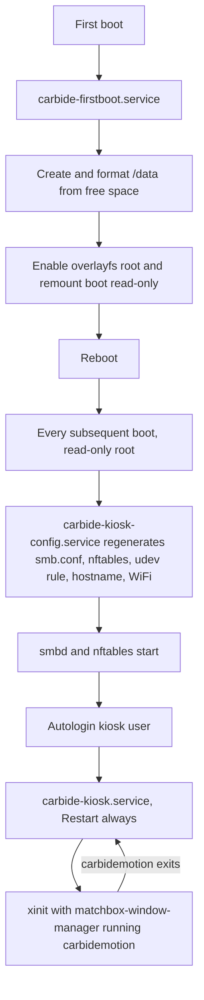

# Carbide Motion Kiosk

A reproducible Raspberry Pi 5 image that boots straight into Carbide Motion, exposes a Samba share for G-code transfer, and survives having its power cut mid-job.

## Goal

Flash one image, drop a config file on the boot partition, power the Pi on next to a Shapeoko. It comes up in Carbide Motion on the attached display with no keyboard, no monitor-and-mouse setup step, and no writable root filesystem to corrupt. Shop machines on the LAN copy `.nc` files to a Samba share; nothing else on the box is reachable from the network.

## Upstream constraints

These are properties of Carbide 3D's Pi package, not choices this project makes. They drive most of the decisions below.

Carbide Motion for Raspberry Pi is distributed from a public bucket at `https://motion-pi.us-east-1.linodeobjects.com/carbidemotion-<build>.deb`. The [download page](https://carbide3d.com/carbidemotion/pi/) resolves the newest build by listing that bucket and taking the highest build number; this project does the same. The package is never redistributed here, which keeps the repository cleanly MIT.

The package is `Architecture: armhf` — 32-bit. Build 654 is version `6.0-654`, 4.6 MB, and links against system Qt5: `libqt5core5a`, `libqt5gui5`, `libqt5widgets5`, `libqt5network5`, `libqt5gamepad5`, `libqt5serialport5`, `libqt5websockets5`. The payload is a single binary at `/usr/local/bin/carbidemotion` plus a desktop entry — there is no bundled runtime and no service.

Those dependency names pin the base to Debian Bookworm. Debian's 64-bit `time_t` transition renamed four of them on armhf — `libqt5core5t64`, `libqt5gui5t64`, `libqt5widgets5t64`, `libqt5network5t64` — so on Trixie the package's dependencies are unsatisfiable. The rename is not cosmetic: the `t64` builds are ABI-incompatible with a binary compiled against 32-bit `time_t`, so satisfying the names with aliases would trade a clean install failure for silent misbehaviour. Bookworm armhf carries all seven under the names the package declares.

Carbide 3D's stated requirement is a Pi 4 on 32-bit Raspbian with a 1280x1024 minimum display, and they have acknowledged Pi 5 rendering problems on very large (>100 MB) G-code files, which are GPU-bound rather than fixable from the image side.

## Decisions

The base is Raspberry Pi OS Lite 32-bit (armhf), Bookworm. The application package is armhf, so a native 32-bit userland takes its Qt5 dependencies straight from the Raspberry Pi OS archive with no multi-arch and no second library stack to track. Bookworm rather than Trixie because of the `t64` rename above. The Pi 5 boots 32-bit Bookworm without issue and Carbide Motion needs nothing 64-bit.

The image is built by [pi-gen](https://github.com/RPi-Distro/pi-gen) inside Docker, pinned to the `2026-06-18-raspios-bookworm-armhf` tag, driven by a single custom stage in this repository and run in CI on every tag. The output is a real flashable `.img`.

The root filesystem is read-only under overlayfs. A third partition, created on first boot from the remaining card space, holds everything that must persist: the Samba share and Carbide Motion's own settings. Power loss can then only ever damage the data partition, which is journaled and mounted with a short commit interval.

Samba runs with a single authenticated account, no guest access. The password is seeded from the boot-partition config file and the share does not come up without one.

## Architecture

### Partitions

The image ships two partitions; the third is created by the first-boot unit from whatever space is left on the card.

- `/boot/firmware` — FAT32, holds `kiosk.conf`. Mounted read-only after first boot.
- `/` — ext4, read-only, overlayfs with a tmpfs upper layer.
- `/data` — ext4, label `CARBIDEDATA`, the only writable persistent storage.

### Boot flow



The first-boot unit disables itself before rebooting, and enabling overlayfs is the last step it takes, since everything after that point is no longer persistent. Because the overlay upper layer is tmpfs, every write to `/etc` is discarded at shutdown, so `carbide-kiosk-config.service` regenerates the Samba, nftables, udev, hostname and WiFi configuration from `kiosk.conf` on every boot rather than once at first boot.

### Kiosk session

`carbide-kiosk.service` runs as the unprivileged `kiosk` user with `Restart=always`, launching `xinit` against a minimal X session: `matchbox-window-manager` for fullscreen, `unclutter` to hide the pointer, `xset s off -dpms` to defeat blanking, then `/usr/local/bin/carbidemotion`. If Carbide Motion crashes or is closed, systemd brings the session straight back. `/etc/X11/Xwrapper.config` allows a non-console user to start X.

Carbide Motion's settings directory is symlinked into `/data` so preferences and machine configuration survive the read-only root.

### Accounts

pi-gen always creates a first user and, when the first-boot rename wizard is disabled — which headless operation requires — insists on a password for it. `build.sh` therefore generates a random password per build and the kiosk stage locks the account immediately. The session is started by systemd, which does not authenticate, so the account never needs a usable password, and no published image carries a known credential. CI asserts both the length and that two builds differ.

The Samba account is separate, created at boot from `kiosk.conf` with a fixed UID so renaming it does not orphan files already on the data partition.

### Network exposure

`nftables` with a default-drop input policy. Permitted inbound: loopback, established and related, and Samba (`445/tcp`, `139/tcp`, `137-138/udp`). SSH is not installed as reachable by default and is opened only when `enable_ssh=1` is set in `kiosk.conf`. mDNS (`5353/udp`, for macOS Finder discovery) is likewise opt-in via `enable_mdns=1`. Everything else — including ICMP echo, unless `enable_ping=1` — is dropped.

### CNC device detection

A udev rule symlinks matching USB serial devices to `/dev/shapeoko` and grants the `kiosk` user access via the `dialout` group. The vendor allowlist is seeded with the IDs Carbide 3D and Shapeoko-family boards are known to present — `03eb` (Atmel, used by the Carbide Motion board), `2341` and `2a03` (Arduino), `1a86` (CH340), `0403` (FTDI) — and is extended from `usb_vendor_ids` in `kiosk.conf` without rebuilding the image.

> [!NOTE]
> The allowlist is seeded from published reports rather than from hardware in hand. Confirming the running-mode vendor and product ID of the specific Shapeoko this image will drive is a task below, not a settled fact.

## Configuration surface

Everything an operator sets lives in `kiosk.conf` on the boot partition, readable from any machine that can mount an SD card. `config/kiosk.conf.example` is the documented template.

- `hostname` — defaults to `carbide-kiosk`.
- `samba_user`, `samba_password` — required; the share stays down without them.
- `samba_share_name`, `samba_min_protocol`, `samba_encrypt` — share naming and transport hardening.
- `wifi_ssid`, `wifi_password`, `wifi_country` — omit entirely for Ethernet.
- `enable_ssh`, `enable_mdns`, `enable_ping` — inbound exceptions, all off by default.
- `usb_vendor_ids` — additional USB vendor IDs to treat as a CNC controller.
- `screen_rotation`, `screen_resolution` — display handling for panel-mounted screens.

Build-time settings live in `build.conf` at the repository root. `build.sh` merges them with the pi-gen variables it generates.

- `CARBIDE_MOTION_BUILD` — pin an exact build number, or leave unset to take the newest.
- `CARBIDE_MOTION_DEB_DIR` — directory searched for an offline `.deb` before any network fetch.
- `DATA_PARTITION_MIN_MB` — refuse first boot on a card too small to hold a useful share.

## Repository layout

```text
carbide-kiosk/
├── build.sh                  pi-gen Docker wrapper
├── build.conf                build-time settings
├── config/
│   └── kiosk.conf.example    runtime settings template
├── deb/                      optional offline Carbide Motion package
├── scripts/
│   └── fetch-carbide-motion.sh
├── stage-kiosk/              custom pi-gen stage
│   ├── 00-packages
│   ├── 01-carbide-motion/
│   ├── 02-kiosk-session/
│   ├── 03-samba/
│   ├── 04-firewall/
│   ├── 05-udev-cnc/
│   ├── 06-resilience/
│   └── 07-firstboot/
└── tests/                    bats suites
```

## Tasks

### Repository foundation

- [x] `git init`, MIT `LICENSE`, `.gitignore` covering `deb/*.deb`, `work/`, `deploy/` and OS litter
- [x] `README.md`: flash, configure, boot, and the Pi 5 caveats from upstream
- [x] `build.sh` wrapper that clones pi-gen at the pinned tag and runs `build-docker.sh`
- [x] `build.conf` with pi-gen variables and this project's build-time settings

### Carbide Motion acquisition

- [x] `scripts/fetch-carbide-motion.sh`: list the bucket, select the highest build, download, verify
- [x] Honour `CARBIDE_MOTION_BUILD` to pin a specific build
- [x] Prefer a local `.deb` in `CARBIDE_MOTION_DEB_DIR` over any network fetch
- [x] Record and check `sha256` for whichever package is used
- [x] Fail the build loudly when neither a local package nor a reachable bucket is available

### Image stage

- [x] `stage-kiosk/00-packages`: Qt5 dependencies, X server, `matchbox-window-manager`, `unclutter`, `samba`, `nftables`
- [x] `01-carbide-motion`: install the `.deb`, symlink settings into `/data`
- [x] `02-kiosk-session`: `kiosk` user, `Xwrapper.config`, X session script, `carbide-kiosk.service`, `carbide-kiosk-config.service`
- [x] `03-samba`: enable `smbd`/`nmbd`; `smb.conf` itself is generated each boot, no guest access
- [x] `04-firewall`: `nftables` default-drop ruleset with the Samba exceptions
- [x] `05-udev-cnc`: `/dev/shapeoko` symlink rule, `dialout` membership
- [x] `06-resilience`: disable swap, systemd hardware watchdog, `/data` mount options
- [x] `07-firstboot`: partition creation, overlayfs enable, self-disable

### Verification

- [x] `shellcheck` over every shell script, failing CI
- [x] `bats` suite for build selection: newest-wins, pin honoured, local package takes precedence, missing-source failure
- [x] `bats` suite for `kiosk.conf` parsing: defaults, required fields, malformed input
- [x] Dependency resolution check: `apt-get install --simulate` for the package list plus the Carbide Motion package in a Debian Bookworm armhf container
- [x] `testparm -s` over the rendered `smb.conf`
- [x] `nft -c -f` over the rendered ruleset
- [x] Render-only mode on the config generator, so CI validates the real generator rather than a copy of it
- [x] `tests/render-config.sh`: 33 assertions over the generated share, firewall, hostname and udev rule, including that a missing library aborts before writing anything
- [x] Pre-commit hook running `shellcheck` and the `bats` suites, so the conventions hold for any tool that writes to this repo

### CI and release

- [x] GitHub Actions workflow: lint and test on push, build the image on tag
- [x] Attach the compressed `.img` and its checksum to the release

### Open

- [ ] Decide how the SSH escape hatch authenticates. The kiosk account is locked, so `enable_ssh=1` currently opens a port that cannot be logged into. Either `kiosk.conf` carries an authorized key, or it carries a password the config generator applies at boot.

### Not yet verified

- [ ] Run `build.sh` end to end and confirm the image builds; nothing below can be checked until it has
- [ ] Boot the built image and confirm the first-boot sequence completes and reboots into Carbide Motion

### Hardware confirmation

- [ ] Confirm the running-mode USB vendor and product ID of the target Shapeoko, and narrow the udev allowlist to it
- [ ] Verify Carbide Motion renders acceptably on the intended display and typical job sizes
- [ ] Pull the power mid-job, ten times, and confirm clean boots with an intact share

## Known risks

Carbide 3D supports this package on a Pi 4, not a Pi 5, and the forum reports large-job rendering problems that no image-side change can address. If the shop's typical G-code exceeds roughly 100 MB, this hardware choice needs revisiting before the rest of the work matters.

Bookworm is oldstable and its security support ends before Carbide 3D is likely to ship an arm64 or Qt6 build. There is no forward path on Trixie without upstream rebuilding against `t64` Qt5, so the plan when Bookworm goes end-of-life is a pinned `snapshot.debian.org` archive rather than a suite upgrade. The narrow network exposure is what makes holding an ageing base tolerable; it is not a reason to widen it.

An overlayfs root means updates are a deliberate act: remount read-write, change, reboot. That is the point, but it makes the box harder to fix in place, which is why the fault path is to reflash rather than to repair.
