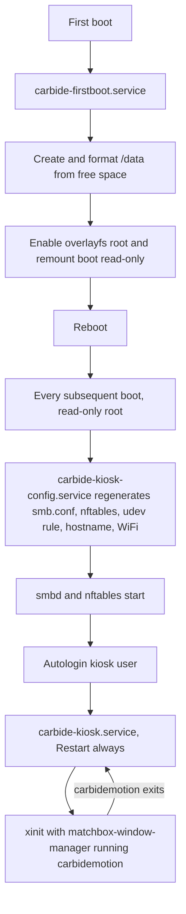

# Carbide Motion Kiosk

A reproducible Raspberry Pi 5 image that boots straight into Carbide Motion, exposes a Samba share for G-code transfer, and survives having its power cut mid-job.

## Goal

Flash one image, drop a config file on the boot partition, power the Pi on next to a Shapeoko. It comes up in Carbide Motion on the attached display with no keyboard, no monitor-and-mouse setup step, and no writable root filesystem to corrupt. Shop machines on the LAN copy `.nc` files to a Samba share; nothing else on the box is reachable from the network.

## Upstream constraints

These are properties of Carbide 3D's Pi package, not choices this project makes. They drive most of the decisions below.

Carbide Motion for Raspberry Pi is distributed from a public bucket at `https://motion-pi.us-east-1.linodeobjects.com/carbidemotion-<build>.deb`. The [download page](https://carbide3d.com/carbidemotion/pi/) resolves the newest build by listing that bucket and taking the highest build number; this project does the same. The package is never redistributed here, which keeps the repository cleanly MIT.

The package is `Architecture: armhf` — 32-bit. Build 654 is version `6.0-654`, 4.6 MB, and links against system Qt5: `libqt5core5a`, `libqt5gui5`, `libqt5widgets5`, `libqt5network5`, `libqt5gamepad5`, `libqt5serialport5`, `libqt5websockets5`. The payload is a single binary at `/usr/local/bin/carbidemotion` plus a desktop entry — there is no bundled runtime and no service.

Those dependency names pin the base to Debian Bookworm. Debian's 64-bit `time_t` transition renamed four of them on armhf — `libqt5core5t64`, `libqt5gui5t64`, `libqt5widgets5t64`, `libqt5network5t64` — so on Trixie the package's dependencies are unsatisfiable. The rename is not cosmetic: the `t64` builds are ABI-incompatible with a binary compiled against 32-bit `time_t`, so satisfying the names with aliases would trade a clean install failure for silent misbehaviour. Bookworm armhf carries all seven under the names the package declares.

Carbide 3D's stated requirement is a Pi 4 on 32-bit Raspbian with a 1280x1024 minimum display, and they have acknowledged Pi 5 rendering problems on very large (>100 MB) G-code files, which are GPU-bound rather than fixable from the image side.

## Decisions at a glance

- 32-bit Raspberry Pi OS Lite, Bookworm, built with pi-gen in Docker at a pinned tag.
- Carbide Motion downloaded at build time, never redistributed; a package in `deb/` overrides the download.
- Read-only root under overlayfs; a third partition, created on first boot, holds all writable state.
- All runtime configuration regenerated every boot from `kiosk.conf` on the boot partition.
- Samba with one authenticated account, no guest access, fixed share UID.
- Samba is the only listener by default. SSH, mDNS and ICMP are opt-in through `kiosk.conf`, which can only be changed by physically removing the card.
- Diagnostics delivered as a plain-text status file in the share, refreshed every five minutes.
- Service access is physical: autologin console on tty2.
- No known credential in the published image; the first-user password is random per build and then disabled.
- Bounded 64M persistent journal on the data partition.

## Decisions

The base is Raspberry Pi OS Lite 32-bit (armhf), Bookworm. The application package is armhf, so a native 32-bit userland takes its Qt5 dependencies straight from the Raspberry Pi OS archive with no multi-arch and no second library stack to track. Bookworm rather than Trixie because of the `t64` rename above. The Pi 5 boots 32-bit Bookworm without issue and Carbide Motion needs nothing 64-bit.

The image is built by [pi-gen](https://github.com/RPi-Distro/pi-gen) inside Docker, pinned to the `2026-06-18-raspios-bookworm-armhf` tag, driven by a single custom stage in this repository and run in CI on every tag. The output is a real flashable `.img`.

The root filesystem is read-only under overlayfs. A third partition, created on first boot from the remaining card space, holds everything that must persist: the Samba share and Carbide Motion's own settings. Power loss can then only ever damage the data partition, which is journaled and mounted with a short commit interval.

Samba runs with a single authenticated account, no guest access. The password is seeded from the boot-partition config file and the share does not come up without one.

## Architecture

### Partitions

The image ships two partitions; the third is created by the first-boot unit from whatever space is left on the card.

- `/boot/firmware` — FAT32, holds `kiosk.conf`. Mounted read-only after first boot.
- `/` — ext4, read-only, overlayfs with a tmpfs upper layer.
- `/data` — ext4, label `CARBIDEDATA`, the only writable persistent storage.

### Boot flow



The first-boot unit disables itself before rebooting, and enabling overlayfs is the last step it takes, since everything after that point is no longer persistent. Because the overlay upper layer is tmpfs, every write to `/etc` is discarded at shutdown, so `carbide-kiosk-config.service` regenerates the Samba, nftables, udev, hostname and WiFi configuration from `kiosk.conf` on every boot rather than once at first boot.

### Confirmed on hardware

Verified on a Pi 5 with a 1920x1200 touch panel and a Shapeoko 5 Pro, over SSH, on 2026-08-26. Carbide Motion runs, connects to the machine and jogs it. The share accepts files from macOS and Carbide Motion can read them. The status file, the screensaver, the keyboard and SSH all work.

Five things were wrong and are fixed. Carbide Motion under-declares its dependencies: it names seven Qt5 libraries and links against an eighth, `libQt5PrintSupport`, so the image needs that explicitly and CI now asks the linker rather than trusting `Depends`. The Shapeoko 5 Pro presents as USB vendor `16d0`, which no published list predicted. The kiosk account was not in the share group, so Carbide Motion could not open the very directory Samba writes to. `matchbox-window-manager` has no window layers, so no on-screen keyboard could float above the application. And the Raspberry Pi OS first-boot hook expands the root partition across the whole card, leaving nothing for the data partition.

A clean flash on 2026-08-29 took the first-boot path end to end for the first time. The data partition is carved from the space the root partition leaves, formatted and mounted, and the machine disables its own first-boot unit and reboots. Three defects surfaced on that run and are fixed. The overlay verification looked for an explicit `initramfs` line in `config.txt`, which this base image does not carry because it relies on `auto_initramfs=1`, so a correctly installed overlay was reported incomplete and the machine came up with a writable root. `carbide-kiosk.service` named a `WorkingDirectory` that only `configure_samba` creates, which turns a configuration failure into a session that cannot start at all - the outcome `Wants=` rather than `Requires=` exists to prevent. And the access unit could exit without opening port 22 while `SuccessExitStatus=0 1` reported that exit as success, leaving a machine with no way in and nothing anywhere saying so.

That third defect was a symptom. Chasing it found two more ways the same image locks itself out, both of which are now closed. The access unit was gated on `ConditionPathExists=/boot/firmware/kiosk.conf`, and a freshly flashed card has no `kiosk.conf` until someone copies one onto it - so on every clean flash systemd skipped the unit outright and reported the skip as success. Underneath that, the access path was a `--access-only` flag on the 450-line configuration script, which meant a syntax error anywhere in that file, on any code path, took the way in down with it.

A clean flash on 2026-08-30 reached Carbide Motion unattended for the first time: the application, the floating keyboard and the session came up on their own with no desktop and no login prompt. Nothing else on that machine worked, because two units deadlocked against systemd in the same way. `carbide-kiosk-access` called `systemctl enable --now ssh`, which asks systemd to start a unit and waits, from inside a unit systemd is still starting; the wait never returned, the unit was killed at `TimeoutStartSec=90`, and `join_network` below it never ran - so a card configured for wifi and no wired fallback came up with no network, no share and no way in, having logged nothing since `opening remote access`. `carbide-kiosk-config` had the same call and a worse version of the problem: it declares `Before=ssh.service`, so ssh.service could not start until the script returned and the script would not return until ssh.service had started. Both now enable the unit and queue its start with `--no-block`, every step announces itself before running so the next hang names the call that caused it, and `tests/units.bats` refuses either form of the blocking call in either script.

That run also showed the read-only root silently not happening. `raspi-config nonint enable_overlayfs` is a wrapper over the `overlayroot` package and fetches it at the moment it is asked, which is first boot - on a machine that had no network, because of the deadlock above. apt failed, raspi-config exited 0 anyway, and `overlayroot=tmpfs` went onto the kernel command line with nothing installed to act on it. The guard did not catch it: it checked that an initramfs file existed, and every image ships one, so it passed on the file the build had written twenty minutes earlier. Both packages are baked into the image now so first boot needs no network, and the guard checks that they are installed and that the initramfs really carries the overlay hook.

The one capability that is not available: no keyboard can appear when a text field is focused. That needs the application to publish focus over accessibility, and Carbide Motion does not. The keyboard is summoned by hand instead.

### Kiosk session

`carbide-kiosk.service` runs as the unprivileged `kiosk` user, launching `xinit` against a minimal X session: `openbox` as the window manager, `xvkbd` as the on-screen keyboard with a one-button `tint2` launcher to summon it, `xscreensaver`, `unclutter` to hide the pointer, then `/usr/local/bin/carbidemotion`. If Carbide Motion crashes the session restarts, but only five times in two minutes: a session that cannot start must leave the operator a usable console rather than fighting them for the keyboard.

openbox rather than matchbox because matchbox has no window layers and the keyboard could never float above the application. The main window is maximised and undecorated rather than fullscreen, deliberately: a fullscreen window outranks the always-on-top layer and would cover the keyboard. Dialogs keep their natural size for the same reason.

Carbide Motion's interface is scaled with `QT_SCALE_FACTOR`. The keyboard is an Athena application and ignores that entirely, so its type is sized separately through X resources.

Carbide Motion's settings directory is symlinked into `/data` so preferences and machine configuration survive the read-only root.

### Accounts

pi-gen always creates a first user and, when the first-boot rename wizard is disabled — which headless operation requires — insists on a password for it. `build.sh` therefore generates a random password per build and the kiosk stage locks the account immediately. The session is started by systemd, which does not authenticate, so the account never needs a usable password, and no published image carries a known credential. CI asserts both the length and that two builds differ.

The Samba account is separate, created at boot from `kiosk.conf` with a fixed UID so renaming it does not orphan files already on the data partition.

### Network exposure

`nftables` with a default-drop input policy. Permitted inbound: loopback, established and related, and Samba (`445/tcp`, `139/tcp`, `137-138/udp`). mDNS (`5353/udp`, for macOS Finder discovery) is opt-in via `enable_mdns=1`, and ICMP echo via `enable_ping=1`. Everything else is dropped.

Remote access is a separate unit running a separate script, `carbide-kiosk-access`, ordered before first-boot setup and before configuration. It shares no code with anything it might have to diagnose: it reads `kiosk.conf` with its own four-line reader rather than sourcing the shared library, and it neither sources nor runs the configuration script. It always runs, and every outcome - including refusing to open the port - is written to `tty1` and to `first-boot.log` on the boot partition, never only to the journal, which is unreadable on exactly the machine these messages are about.

Credentials come from `kiosk.conf` or from a plain `authorized_keys` file on the boot partition. The second is the way back into a machine whose config file never arrived or cannot be parsed; dropping a key next to it is as physical an act as editing it. Nothing is baked into the image, so no published image carries a credential. Once a `kiosk.conf` does exist it is authoritative: configuration runs moments later and closes the port again unless `enable_ssh=1` is actually set, and the access script says so on the console when it sees that combination, because a door that opens and shuts looks identical to a crash from the other end.

SSH is off by default and opens only when `enable_ssh=1` is paired with a credential. `enable_ssh=1` on its own leaves the port shut: an open port onto an account nobody can authenticate against is worse than no port. A key in `ssh_authorized_key` is preferred and disables password authentication outright; `ssh_password` exists as a fallback and is stored in clear text on the card.

The door is gated on physical possession. `kiosk.conf` lives on the boot partition, so opening SSH means powering the machine down, taking the card out, and editing it on another computer. Nothing reachable over the network can turn it on.

When open, `sshd` permits only the `kiosk` account, refuses root, refuses empty passwords, disables both forwarding kinds, allows three authentication attempts and a twenty-second grace period. New connections to port 22 are rate limited to six a minute in the firewall, which blunts brute force without a log-scraping daemon. The host key lives on the data partition so it survives the volatile overlay and does not change on every boot.

### Diagnostics

The appliance reports on itself through the share, the way a printer has a status page rather than a shell. `carbide-kiosk-status` writes `CARBIDE-STATUS.txt` into the share on boot and every five minutes: whether Carbide Motion is running and how often it has restarted, whether the Shapeoko is detected, free space, temperature, power-supply throttling, and recent errors from this boot and the one before it. It is plain text, so it opens on any machine that can reach the share — which matters because the data partition is ext4 and a Mac cannot read it off the card.

Nothing from `kiosk.conf` reaches that file except the hostname and share name. Everything else is observed state, and the writer strips the configured Samba and WiFi passwords from its own output in case one leaks through a quoted log line. Six tests cover that stripping.

Service access is physical. `getty@tty2` autologins the kiosk account, so Ctrl+Alt+F2 on a keyboard plugged into the machine gives a console. Anyone who can reach that keyboard can already remove the SD card, so it withholds nothing that matters, and it avoids a password that would otherwise have to live in a file.

### CNC device detection

A udev rule symlinks matching USB serial devices to `/dev/shapeoko` and grants the `kiosk` user access via the `dialout` group. The vendor allowlist is seeded with the IDs Carbide 3D and Shapeoko-family boards are known to present — `03eb` (Atmel, used by the Carbide Motion board), `2341` and `2a03` (Arduino), `1a86` (CH340), `0403` (FTDI) — and is extended from `usb_vendor_ids` in `kiosk.conf` without rebuilding the image.

> [!NOTE]
> The allowlist is seeded from published reports rather than from hardware in hand. Confirming the running-mode vendor and product ID of the specific Shapeoko this image will drive is a task below, not a settled fact.

## Configuration surface

Everything an operator sets lives in `kiosk.conf` on the boot partition, readable from any machine that can mount an SD card. `config/kiosk.conf.example` is the documented template.

- `hostname` — defaults to `carbide-kiosk`.
- `samba_user`, `samba_password` — required; the share stays down without them.
- `samba_share_name`, `samba_min_protocol`, `samba_encrypt` — share naming and transport hardening.
- `wifi_ssid`, `wifi_password`, `wifi_country` — omit entirely for Ethernet.
- `enable_ssh`, `ssh_authorized_key`, `ssh_password` — troubleshooting access, off by default and refusing to open without a credential.
- `enable_mdns`, `enable_ping` — inbound exceptions, both off by default.
- `usb_vendor_ids` — additional USB vendor IDs to treat as a CNC controller.
- `screen_rotation`, `screen_resolution` — display handling for panel-mounted screens.

Build-time settings live in `build.conf` at the repository root. `build.sh` merges them with the pi-gen variables it generates.

- `CARBIDE_MOTION_BUILD` — pin an exact build number, or leave unset to take the newest.
- `CARBIDE_MOTION_DEB_DIR` — directory searched for an offline `.deb` before any network fetch.
- `DATA_PARTITION_MIN_MB` — refuse first boot on a card too small to hold a useful share.

## Repository layout

```text
carbide-kiosk/
├── build.sh                  pi-gen Docker wrapper
├── build.conf                build-time settings
├── config/
│   └── kiosk.conf.example    runtime settings template
├── deb/                      optional offline Carbide Motion package
├── scripts/
│   └── fetch-carbide-motion.sh
├── stage-kiosk/              custom pi-gen stage
│   ├── 00-base/00-packages
│   ├── 01-carbide-motion/
│   ├── 02-kiosk-session/
│   ├── 03-samba/
│   ├── 04-firewall/
│   ├── 05-udev-cnc/
│   ├── 06-resilience/
│   └── 07-firstboot/
└── tests/                    bats suites
```

## Tasks

### Repository foundation

- [x] `git init`, MIT `LICENSE`, `.gitignore` covering `deb/*.deb`, `work/`, `deploy/` and OS litter
- [x] `README.md`: flash, configure, boot, and the Pi 5 caveats from upstream
- [x] `build.sh` wrapper that clones pi-gen at the pinned tag and runs `build-docker.sh`
- [x] `build.conf` with pi-gen variables and this project's build-time settings

### Carbide Motion acquisition

- [x] `scripts/fetch-carbide-motion.sh`: list the bucket, select the highest build, download, verify
- [x] Honour `CARBIDE_MOTION_BUILD` to pin a specific build
- [x] Prefer a local `.deb` in `CARBIDE_MOTION_DEB_DIR` over any network fetch
- [x] Record and check `sha256` for whichever package is used
- [x] Fail the build loudly when neither a local package nor a reachable bucket is available

### Image stage

- [x] `stage-kiosk/00-base/00-packages`: Qt5 dependencies, X server, `matchbox-window-manager`, `unclutter`, `samba`, `nftables`
- [x] `01-carbide-motion`: install the `.deb`, symlink settings into `/data`
- [x] `02-kiosk-session`: `kiosk` user, `Xwrapper.config`, X session script, `carbide-kiosk.service`, `carbide-kiosk-config.service`
- [x] `03-samba`: enable `smbd`/`nmbd`; `smb.conf` itself is generated each boot, no guest access
- [x] `04-firewall`: `nftables` default-drop ruleset with the Samba exceptions
- [x] `05-udev-cnc`: `/dev/shapeoko` symlink rule, `dialout` membership
- [x] `06-resilience`: disable swap, systemd hardware watchdog, `/data` mount options, bounded persistent journal on `/data`
- [x] `07-firstboot`: partition creation, overlayfs enable, self-disable
- [x] `08-status`: status writer, timer, and the redaction that keeps secrets out of the share
- [x] `09-boot-cmdline`: remove the Raspberry Pi OS first-boot resize hook so the card is not consumed by the root partition

### Verification

- [x] `shellcheck` over every shell script, failing CI
- [x] `bats` suite for build selection: newest-wins, pin honoured, local package takes precedence, missing-source failure
- [x] `bats` suite for `kiosk.conf` parsing: defaults, required fields, malformed input
- [x] Dependency resolution check: `apt-get install --simulate` for the package list plus the Carbide Motion package in a Debian Bookworm armhf container
- [x] `testparm -s` over the rendered `smb.conf`
- [x] `nft -c -f` over the rendered ruleset
- [x] Render-only mode on the config generator, so CI validates the real generator rather than a copy of it
- [x] `bats` suite asserting the status writer strips configured passwords from its output
- [x] `bats` suite refusing a blocking `systemctl` start in either boot script, and refusing an overlay the initramfs cannot actually perform
- [x] `tests/render-config.sh`: 49 assertions over the generated share, firewall, hostname and udev rule, including that a missing library aborts before writing anything
- [x] Pre-commit hook running `shellcheck` and the `bats` suites, so the conventions hold for any tool that writes to this repo

### CI and release

- [x] GitHub Actions workflow: lint and test on push, build the image on tag
- [x] Attach the compressed `.img` and its checksum to the release

### Open

### Not yet verified

- [ ] Confirm the access unit opens port 22 before first-boot setup, so a boot that fails anywhere else is still reachable. This is the guarantee everything else is diagnosed through, and it has never held on hardware. It failed again on 2026-08-30, to the `systemctl --now` deadlock described above. Confirm it specifically on a card with no `kiosk.conf` and only an `authorized_keys` file, which is the case that used to lock the machine out silently.
- [ ] Confirm the overlay engages, so the root is read-only and the machine tolerates losing power. It did not on 2026-08-30, and reported success; confirm by checking that `/` is an overlay mount on a booted machine, not by trusting the first-boot log.
- [ ] Confirm `agetty --autologin` accepts an account whose password field is `*`, so the physical console actually works

### Hardware confirmation

- [x] A clean flash reaching Carbide Motion unattended, confirmed on 2026-08-30
- [ ] Verify Carbide Motion renders acceptably on the intended display and typical job sizes
- [ ] Pull the power mid-job, ten times, and confirm clean boots with an intact share

## Known risks

Carbide 3D supports this package on a Pi 4, not a Pi 5, and the forum reports large-job rendering problems that no image-side change can address. If the shop's typical G-code exceeds roughly 100 MB, this hardware choice needs revisiting before the rest of the work matters.

Bookworm is oldstable and its security support ends before Carbide 3D is likely to ship an arm64 or Qt6 build. There is no forward path on Trixie without upstream rebuilding against `t64` Qt5, so the plan when Bookworm goes end-of-life is a pinned `snapshot.debian.org` archive rather than a suite upgrade. The narrow network exposure is what makes holding an ageing base tolerable; it is not a reason to widen it.

An overlayfs root means updates are a deliberate act: remount read-write, change, reboot. That is the point, but it makes the box harder to fix in place, which is why the fault path is to reflash rather than to repair. Reflashing also destroys the data partition, so the share is a drop box for jobs and not where masters live.

The hardware watchdog reboots if PID 1 stops responding. Mid-job that stops the G-code stream while the spindle is still turning, which ruins the workpiece. It is kept because by the time it fires the machine is already unresponsive, but it is a deliberate trade rather than a free safety net.
